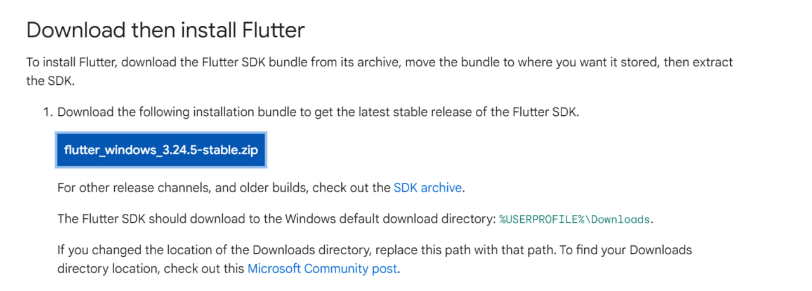

# Введение, настройка среды

1. Установка Flutter

2. Установка Android Studio.

3. Настройка Android эмулятора.

4. Установка VS Code

5. Создание проекта

6. Обзор папок в Flutter приложении

7. Hot Reload и Hot Restart
Hot Reload - Позволяет быстро обновить UI приложения, внося изменения в код, не теряя текущее состояние приложения.
Hot Restart - Перезапускает приложение, сбрасывая его состояние. Все изменения в коде применяются, но текущее состояние (например, данные в памяти) теряется.

