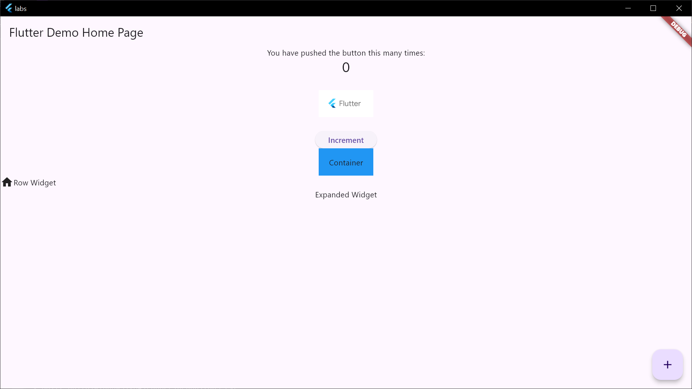

# Введение в виджеты
1. runApp
2. MaterialApp
3. Scaffold
4. Типы виджетов
5. Stateless Widget
6. StatefulWidget
7. Работа с Asset и Image
8. Работа с Asset и Font

[Код](../labs/lib/lab2.dart)
[Ассеты](../labs/assets)