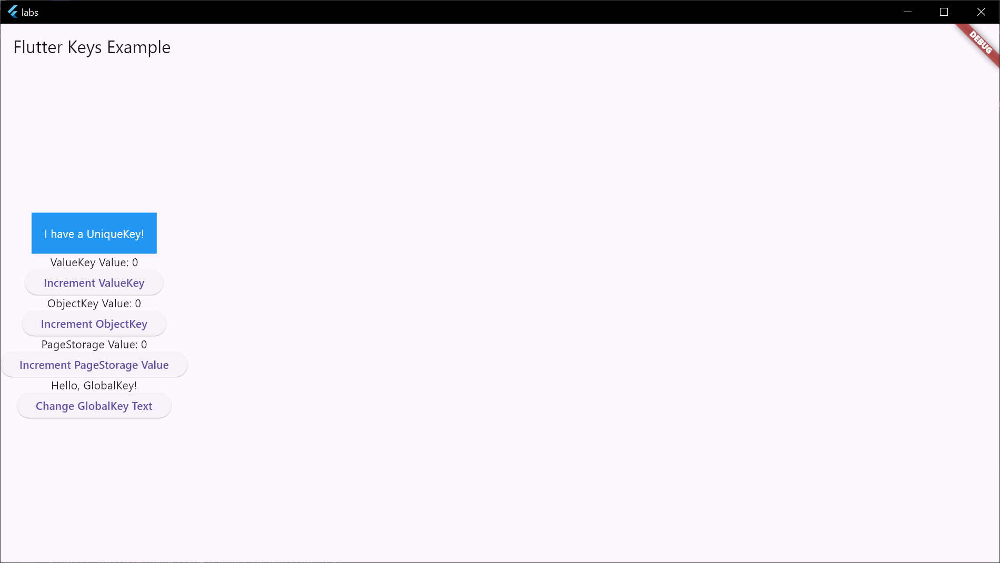

# Введение в ключи

1. Для чего нужны key

Параметр key можно найти практически в каждом конструкторе виджета, но используют этот параметр при разработке достаточно редко. Keys сохраняют состояние при перемещении виджетов в дереве виджетов.
2. UniqueKey
3. ValueKey
4. ObjectKey
5. PageStorageKey
6. GlobalKey

[Код](../labs/lib/lab3.dart)