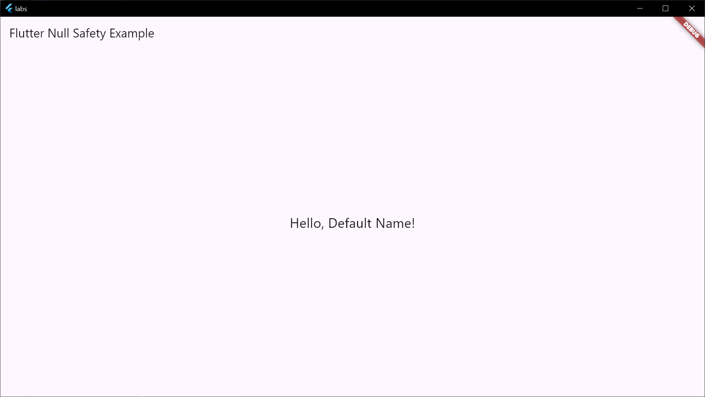

# Dart - работа с Null Safety

1. Что такое Null Safety
2. Основные принципы Null Safety
3. Иерархия типов
4. Null-aware операторы
5. Каскадный null-aware оператор
6. Модификатор late
7. Работа с коллекциями
8. Работа с параметрами класса
9. Работа с параметрами класса

[Код](../labs/lib/lab5.dart)