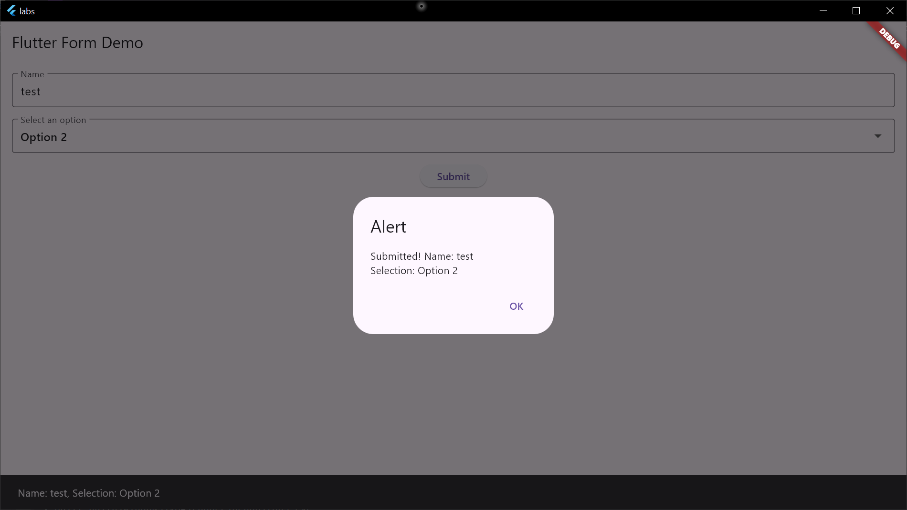

# Взаимодействие с пользователем

1. Form
2. TextField и TextFormField
3. Стилизация полей ввода
4. Ограничения ввода в поля формы
5. Получение текста из полей формы
6. Валидация полей формы
7. Выпадающий список
8. "Фокусировка" полей ввода
9. SnackBar
10. AlertDialog
11. Использование жестов

[Код](../labs/lib/lab7.dart)