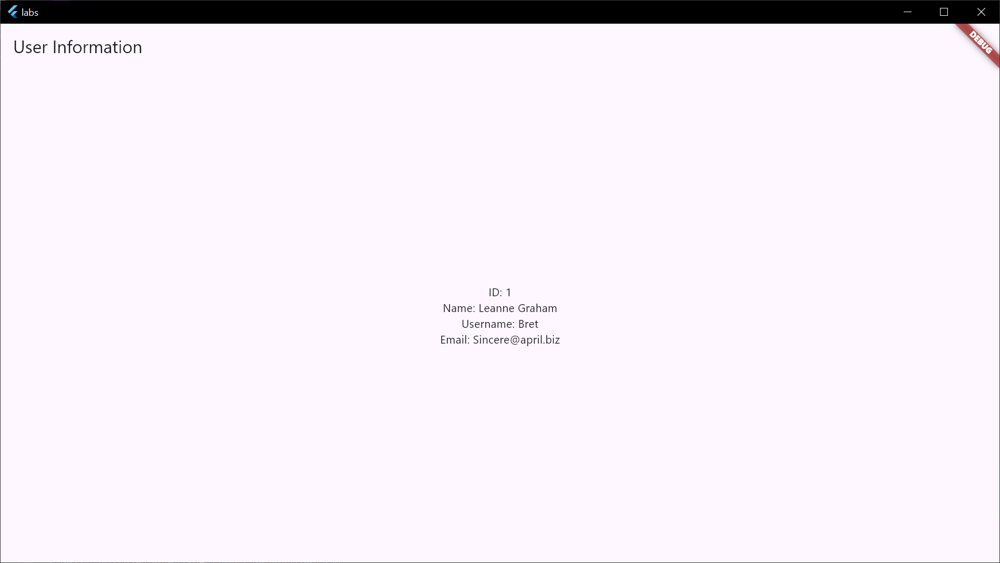

# Работа с HTTP (отправка запросов)

1. http
2. Введение в JSON
3. Ручная сериализация JSON. Создание модели, отображение данных.
4. Автогенерируемая сериализация JSON

[Модель](../labs/lib/lab8.g.dart)
[Код](../labs/lib/lab8.dart)